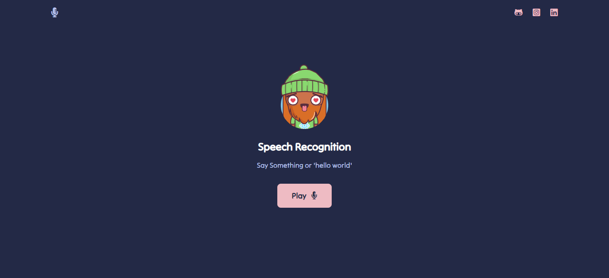

### Speech Recognition 

<p>Projeto web de reconhecimento de voz com API <b>Speech Recognition</b>, o site fora desenvolvido com HTML, CSS, Javascript e ferramentas como Webpack e Babel.</p>



#### Executando ⚙️

```sh
# Website: https://recorder-speechR.netlify.app/

# Clone
$ git clone https://github.com/EricNeves/simpleSPA.git

# Install Dependencies
$ cd speechRecognition && npm install

# Execute
$ npm start
# Run mode development 
$ npm run dev
# Build
$ npm run build
```

#### Ferramentas 🛠

   * HTML5
   * CSS3
   * Javascript
     * Speech Recognition
   * NodeJS
     * [Express]('https://expressjs.com/')
     * [Webpack]('https://webpack.js.org/')
     * [Babel]('https://babeljs.io/')

#### License

